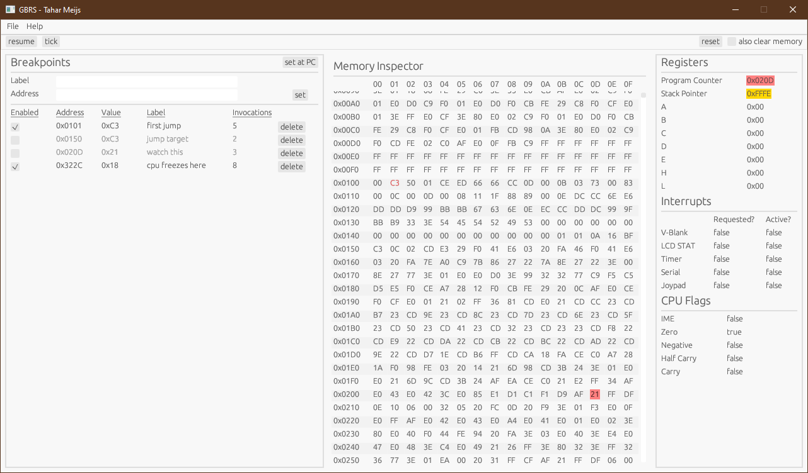

# GBRS - A GameBoy emulator written in Rust
Hiya, welcome to the GBRS project!

This project has been created for educational purposes only. The goal is to write a very simple
GameBoy emulator using Rust. My emulator will not be as good as the commercial alternatives out
there, however, I do hope it will serve as an excellent playground for anyone interested in GameBoy
emulator development.

Since all this is a pretty massive undertaking and I am just working on this during my weekends, it
may take some time to see any significant progress. I will try to keep this project updated for as
long as possible.

If you would like to get in touch with me to discuss this project, please do so! I would love to
hear your thoughts.

Cheers,

Tahar

## Changelog
### 31-07-2022
- Refactored CPU and memory debugging tools.
- Added placeholder panel for breakpoints.
- Added stack pointer and program counter highlighting.

### 25-07-2022
- Restructured project to make it easier to find modules.
- Started working on basic CPU and memory debugging tools.

### 14-07-2022
- Added initial implementation of most 8-bit CPU opcodes.

### 13-07-2022
- Added cartridge loading.
- Added basic fetch-decode-execute loop.

### 11-07-2022
- Initial project set-up.
